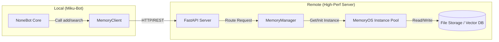

# Miku-Bot 记忆系统重构方案：基于远程 MemoryOS 服务

## 1. 背景与目标

当前 Miku-Bot 运行在资源受限的环境中（显存吃紧），而 `MemoryOS` 作为一个先进的记忆系统，依赖较大的 Embedding 模型（如 `bge-m3`）和复杂的内存操作。为了在不升级本地硬件的前提下引入 `MemoryOS` 的能力，我们计划将其部署为独立的微服务，运行在 Zerotier 网络内的高性能机器上。

**目标：**
1.  **解耦**：将记忆服务从 Bot 核心逻辑中剥离。
2.  **性能**：利用远程机器的 GPU 资源运行高质量 Embedding 模型。
3.  **持久化**：支持多用户、多群组的记忆隔离与持久化。

## 2. 架构设计

### 2.1 总体架构



### 2.2 服务端设计 (MemoryOS Service)

服务端是一个基于 FastAPI 的 Python 应用。

*   **核心组件**：
    *   **MemoryManager**：负责管理 `Memoryos` 实例的生命周期。
        *   使用 LRU 缓存机制管理活跃的 `user_id` 实例。
        *   自动处理实例的初始化、加载和资源释放。
    *   **API Endpoints**：
        *   `POST /v1/memory/add`: 添加对话记录。
        *   `POST /v1/memory/search`: 检索相关记忆。
        *   `GET /v1/profile/{user_id}`: 获取用户画像。
        *   `POST /v1/manage/flush`: 强制持久化所有数据。
    *   **配置管理**：
        *   支持配置 Embedding 模型（本地 `bge-m3` 或 API）。
        *   支持配置 LLM 后端（OpenAI/DeepSeek）。

### 2.3 客户端设计 (Miku-Bot)

在 Miku-Bot 侧，我们需要重写 `src/common/memory_service.py`。

*   **MemoryService 类**：
    *   保持现有的 `add`, `search`, `save_chat_memory` 接口签名不变，确保插件无感。
    *   内部不再调用 `mem0`，而是使用 `httpx.AsyncClient` 调用远程 API。
*   **配置**：
    *   `MEMORY_API_URL`: 远程服务地址 (e.g., `http://192.168.192.x:8000`).
    *   `MEMORY_API_KEY`: 访问密钥（可选）。

## 3. 详细实施步骤

### Phase 1: 服务端开发 (Remote)

1.  **项目准备**：
    *   在 `new_plan` 下创建 `memory_service_backend` 目录。
    *   将 `MemoryOS` 核心代码 (`memoryos-pypi`) 复制入内或作为依赖引用。
2.  **API 实现**：
    *   编写 `main.py` (FastAPI)。
    *   实现 `MemoryManager` 类，处理多用户并发。
3.  **Docker化**：
    *   编写 `Dockerfile`，确保包含 `bge-m3` 等模型的依赖（`FlagEmbedding`, `torch` 等）。

### Phase 2: 客户端适配 (Local)

1.  **重构 `src/common/memory_service.py`**：
    *   移除 `mem0` 依赖。
    *   实现 HTTP 调用逻辑。
    *   增加断路器（Circuit Breaker）机制：如果远程服务不可用，降级为“无记忆模式”或“仅短期内存模式”，防止 Bot 崩溃。

### Phase 3: 部署与联调

1.  **远程部署**：在高性能机器上启动 Docker 容器。
2.  **网络配置**：确保 Zerotier IP 互通。
3.  **灰度测试**：在 Miku-Bot 中开启新配置，进行单用户测试。

## 4. API 接口定义 (Draft)

```yaml
openapi: 3.0.0
paths:
  /v1/memory/add:
    post:
      summary: 添加记忆
      requestBody:
        content:
          application/json:
            schema:
              type: object
              properties:
                user_id: {type: string}
                user_input: {type: string}
                agent_response: {type: string}
                group_id: {type: string} # 可选，用于群组隔离上下文
                timestamp: {type: string}
  /v1/memory/search:
    post:
      summary: 检索记忆
      requestBody:
        content:
          application/json:
            schema:
              type: object
              properties:
                user_id: {type: string}
                query: {type: string}
      responses:
        200:
          description: 返回相关的记忆片段、用户画像摘要。
  /v1/profile/{user_id}:
    get:
      summary: 获取完整用户画像
```

## 5. 多用户/群组策略细节

MemoryOS 原生是基于 `user_id` 的。在群聊场景下：

*   **策略 A (当前采用)**：每个群成员拥有独立的记忆库。
    *   `user_id` = `user_{qq_id}`
    *   优点：画像精准。
    *   缺点：无法检索“大家一起聊过的事”（除非每个人都存了一份）。
*   **策略 B (群组混合)**：
    *   `user_id` = `group_{group_id}_{qq_id}` (独立但带群组前缀)
    *   或者 `user_id` = `group_{group_id}` (整个群共享一个记忆，不推荐，会混乱)。

**建议**：采用 **策略 A**，但在 metadata 中记录 `group_id`。检索时主要检索个人记忆，未来可扩展检索群组公共事件的功能。

## 6. 风险与对策

1.  **网络延迟**：
    *   *对策*：异步调用，设置合理的超时时间（如 3s）。对于非关键的 `add_memory` 操作，可以 "Fire and Forget"（发送后不等待响应）。
2.  **服务端崩溃**：
    *   *对策*：客户端实现降级逻辑。
3.  **数据安全**：
    *   *对策*：Zerotier 本身是加密的。API 增加简单的 Token 认证。

